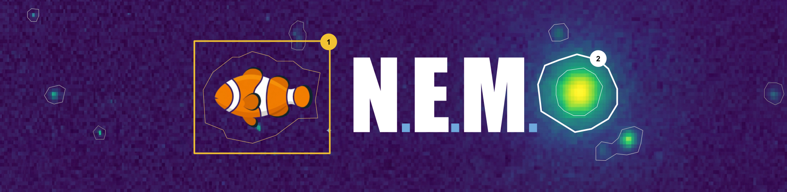

<div align="center">
  
  <h1>N.E.M.O. [<b>N</b>on-stationary <b>E</b>xtraction via <b>M</b>ultiscale <b>O</b>ptical-flow]</h1>
  <p>
    
    
    
  </p>
</div>

---

NEMO is a Python pipeline for detecting and tracking compact emission sources across the spectral axis of 3-D radio interferometric data cubes (FITS, HDF5, NumPy). It combines a multiscale starlet wavelet detector with TV-L1 optical flow tracking, kinematic classification, and a dual-metric false-detection filter. The design targets ALMA [C II] IFU cubes of high-redshift quasar fields where sources exhibit Doppler-shifted, kinematically active sub-structure across tens of spectral channels.

---

## Table of Contents

1. [Scientific Motivation](#scientific-motivation)
2. [Pipeline Overview](#pipeline-overview)
3. [Methodology](#methodology)
   - [Stage 1 — Starlet Wavelet Detection](#stage-1--starlet-wavelet-detection)
   - [Stage 2 — Masked TV-L1 Optical Flow](#stage-2--masked-tv-l1-optical-flow)
   - [Stage 3 — Track Linking: Splits, Merges, and Source Identification](#stage-3--track-linking-splits-merges-and-source-identification)
   - [Stage 4 — Kinematic Classification](#stage-4--kinematic-classification)
   - [Stage 5 — False-Detection Removal](#stage-5--false-detection-removal)
4. [Results: W2246-0526](#results-w2246-0526)
5. [Installation](#installation)
6. [Quick Start](#quick-start)
7. [Graphical Interface](#graphical-interface)
8. [API Reference](#api-reference)
9. [CLI Reference](#cli-reference)
10. [Dependencies](#dependencies)

---

## Scientific Motivation

High-redshift quasar host galaxies observed in emission lines such as [C II] 158 µm with ALMA produce spectral data cubes in which the same physical gas cloud may manifest as spatially displaced emission components across many spectral channels due to bulk kinematics (rotation, outflows, merging companions). Standard source-finding tools (SExtractor, PyBDSF) operate on collapsed moment-0 maps and cannot resolve multi-component structure in velocity space, nor can they track the spatial trajectory of emission across channels. NEMO addresses this by treating each channel slice as a separate detection plane and connecting detections across velocity with flow-guided track linking.

---

## Pipeline Overview

```
  Raw FITS cube  ──►  [Stage 0]  IST Denoising (optional)
                                        │
                                        ▼
                       [Stage 1]  Starlet Wavelet Detection
                                  per channel slice
                                        │
                                        ▼
                       [Stage 2]  Masked TV-L1 Optical Flow
                                  between consecutive channels
                                        │
                                        ▼
                       [Stage 3]  Track Linking
                                  advected-mask propagation +
                                  Hungarian assignment +
                                  split / merge detection
                                        │
                                        ▼
                       [Stage 4]  Kinematic Classification
                                        │
                                        ▼
                       [Stage 5]  Source Grouping (union-find)
                                  + False-Detection Removal
                                        │
                                        ▼
                       TrackingResult  {sources, tracks,
                                        false_detections, …}
```

---

## Methodology

### Stage 1 — Starlet Wavelet Detection

Each channel slice $I_c \in \mathbb{R}^{H \times W}$ is independently analysed with the **undecimated isotropic wavelet transform** (à trous IUWT, also known as the starlet transform).

#### Starlet Transform

The transform decomposes a 2-D image into $J - 1$ detail bands plus a coarse residual:

$$\mathcal{W}[I] = \{w_1, w_2, \ldots, w_{J-1}, c_{J-1}\}$$

where the detail coefficient at scale $j$ is

$$w_j = c_{j-1} - c_j, \qquad j = 1, \ldots, J-1$$

and each successive approximation $c_j$ is obtained by a **separable à trous B₃-spline convolution** with dilation $2^{j-1}$:

$$c_j = h^{(j)} \star c_{j-1}, \qquad h^{(j)}[k] = \frac{1}{16}\bigl[1,\, 4,\, 6,\, 4,\, 1\bigr] \text{ at step } 2^{j-1}$$

The B₃-spline kernel $h = [1/16,\, 1/4,\, 3/8,\, 1/4,\, 1/16]$ is applied in two separable passes (row then column) via PyTorch dilated convolution, giving $\mathcal{O}(5HW)$ per scale and $\mathcal{O}(5JHW)$ total, independent of $j$.

#### Scale-Adaptive Thresholding

The noise level at each detail scale is estimated from the **Median Absolute Deviation (MAD)**:

$$\hat{\sigma}_j = 1.4826 \times \mathrm{median}\bigl(|w_j - \mathrm{median}(w_j)|\bigr)$$

The factor 1.4826 makes $\hat{\sigma}_j$ a consistent estimator of the standard deviation under Gaussian noise. To prevent collapse of the per-channel MAD estimate on nearly empty channels (where the denoised residual is near-deterministic and $\hat{\sigma}_j \to 0$), the noise reference is anchored to the **mean-map decomposition**:

$$\bar{I} = \frac{1}{|C|} \sum_{c \in C} I_c, \qquad \hat{\sigma}_j^{\text{ref}} = \hat{\sigma}_j(\bar{I}) \cdot \sqrt{|C|}$$

where $|C|$ is the number of active channels. The $\sqrt{|C|}$ factor recovers the single-channel noise from the mean-map noise, which is suppressed by $1/\sqrt{|C|}$ through averaging.

A pixel is declared significant at scale $j$ if

$$|w_j| > k_\sigma \cdot \hat{\sigma}_j^{\text{ref}}$$

where $k_\sigma$ is a user-controlled detection threshold passed as `k_sigma`. Only positive coefficients (emission) are retained; the absolute flux floor is similarly parameterised via `thresh`.

#### Component Extraction

Connected-component labelling is applied to the thresholded detail plane at the selected scale (`use_scale`, 1-based). Components with area below `min_area` pixels are discarded. For each surviving component, the pipeline records:
- **Peak coordinate** $(r_{\rm peak}, c_{\rm peak})$
- **Binary footprint mask** $M_b \in \{0,1\}^{H \times W}$
- **Bounding box** $(y_0, x_0, y_1, x_1)$

---

### Stage 2 — Masked TV-L1 Optical Flow

Rather than computing flow across the full field (which would be dominated by noise), NEMO restricts the TV-L1 solver to the **union of source footprints** from consecutive channel pair $(c, c+1)$:

$$\Omega_{c,c+1} = \left(\bigcup_b M_b^{(c)}\right) \cup \left(\bigcup_b M_b^{(c+1)}\right)$$

The images are zeroed outside $\Omega_{c,c+1}$ before the solver runs:

$$\tilde{I}_c = I_c \cdot \mathbb{1}_{\Omega}, \qquad \tilde{I}_{c+1} = I_{c+1} \cdot \mathbb{1}_{\Omega}$$

The TV-L1 optical flow problem then minimises:

$$\mathbf{v}^* = \mathop{\arg\min}_{\mathbf{v}} \left\| \nabla \tilde{I}_c + (\mathbf{v} \cdot \nabla)\tilde{I}_c \right\|_1 + \lambda \|\nabla \mathbf{v}\|_1$$

The union mask (rather than the intersection) is critical for split detection: when a source splits into a new spatial location between channels, the two components may not overlap. An intersection mask would produce $\mathbf{v} = 0$ everywhere, misclassifying the split-off component as a new independent source.

The resulting flow field $\mathbf{v} = (v_r, v_c) \in \mathbb{R}^{2 \times H \times W}$ encodes the per-pixel row and column displacements between adjacent channels.

---

### Stage 3 — Track Linking: Splits, Merges, and Source Identification

The central challenge in spectral-cube tracking is that a single physical gas structure can fragment into multiple spatially separated emission components as velocity shear spreads its emission across channels, and those fragments can later converge back into one component. NEMO captures this behaviour by maintaining a **advected mask** for each active track: a running estimate of where the track's footprint is predicted to land in the next channel, obtained by advecting the most recently confirmed wavelet footprint through the TV-L1 flow field. Matching is based on pixel overlap between advected and detected component masks — not Euclidean centroid distance — which allows correct attribution even when components move several resolution elements between channels.

#### Advected Mask Propagation

Given a confirmed source footprint $M^{(t)} \in \{0,1\}^{H \times W}$ and the flow field $\mathbf{v} = (v_r, v_c)$ computed between channels $t$ and $t+1$, every pixel $(y, x)$ in the footprint is displaced to a predicted destination:

$$\mathcal{A}[M, \mathbf{v}](y', x') = \sum_{(y,x)\,:\,M(y,x)=1} \delta\!\left(y' - \lfloor y + v_r(y,x) \rceil\right) \delta\!\left(x' - \lfloor x + v_c(y,x) \rceil\right)$$

where $v_r, v_c$ are sampled at sub-pixel positions via Catmull-Rom cubic interpolation (`scipy.ndimage.map_coordinates(order=3)`). The result $\mathcal{A}$ is a floating-point weight map: each non-zero entry counts how many source pixels were advected to that destination. Overlap between $\mathcal{A}$ and a candidate component mask is computed as $\sum_{y,x} \mathcal{A}(y,x) \cdot M_{\rm blob}(y,x)$, a dot product that naturally down-weights sparsely populated destination pixels.

The track centroid is extrapolated by the same interpolation:

$$(\hat{r}_{t+1}, \hat{c}_{t+1}) = (r_t + v_r(r_t, c_t),\; c_t + v_c(r_t, c_t))$$

#### Two-Pass Matching Protocol

Track linking runs **twice** over the cube — once forward (channel 0 → N) and once backward (channel N → 0). Each pass uses the same three-step matching algorithm per channel transition. Splits are not detected directly in the forward pass; instead they are detected as **merges in the backward pass** and then reconciled.

---

**Forward pass — steps per channel transition $(c_{\rm ref} \to c_{\rm tgt})$**

**Step A — Continuation matching (Hungarian algorithm)**

The cost matrix $\mathcal{C} \in \mathbb{R}^{N_{\rm tracks} \times N_{\rm blobs}}$ measures the negative pixel overlap between each track's advected mask and each component footprint:

$$\mathcal{C}_{ij} = -\sum_{y,x} \mathcal{A}[M_i^{\rm adv}, \mathbf{v}](y,x) \cdot M_j^{(c_{\rm tgt})}(y,x)$$

The globally optimal one-to-one assignment is solved with the Hungarian algorithm in $\mathcal{O}(N^3)$. A pair $(i, j)$ is accepted as a **continuation** only if $-\mathcal{C}_{ij} \geq \varepsilon_{\rm match}$ (default 5 px); the advected mask of track $i$ is reset to component $j$'s footprint.

**Step B — Merge detection**

For tracks not matched in Step A, the advected mask is compared against every component already claimed by another track. If the overlap $\geq \varepsilon_{\rm match}$, the unmatched track is classified as **merging**: it records the channel and target track in its `merge_into` list and is deactivated.

**Step C — Gap bridging and new tracks**

Tracks still unmatched after Step B have their advected mask frozen in place and their gap age incremented. If gap age exceeds `max_gap_channels` the track is deactivated. Any component not claimed by any track in Steps A–B seeds a new independent track — no split attribution is performed here.

---

**Backward pass — split detection via symmetric merge**

The same A–B–C algorithm is run on the channel sequence in reverse, with the flow field negated so that advection points backward in velocity. A **split** in the forward direction (one parent footprint fragmenting into two children) appears as a **merge** in the backward direction (two backward tracks converging onto one component). The backward pass therefore records these events as ordinary `merge_into` annotations.

**Split reconciliation**

After both passes complete, `_reconcile_splits` matches each backward track to its forward counterpart by trajectory voting: for every shared channel, the forward track whose centroid is within 5 px of the backward track's centroid gets a vote; the forward track with the most votes wins. Each `merge_into` event in the backward pass is then transferred as a `split_from` / `split_at` annotation on the corresponding forward tracks.

#### What a Track Is vs. What a Source Is

A **track** is a sequence of per-channel centroid positions and footprint masks that corresponds to a *single connected emission component* in each channel. A track starts when a component first appears (either as a seed in the first processed channel, a split, or a genuinely new object) and ends when the component deactivates (merges, disappears for too long, or the cube ends).

A **source** is a *physical object* — a gas structure that may fragment and rejoin across channels. All tracks connected by any chain of split or merge relationships belong to the same source. This grouping is performed in Stage 5 via a path-compressed union-find over the `split_from` (child→parent) and `merge_into` (merging→target) edges recorded during track linking. The union-find ensures that even indirect connections — track A splits from B, and B later merges into C — correctly place A, B, and C in the same source.

```
SPLIT — parent track fragments; child track born at the split channel
──────────────────────────────────────────────────────────────────────────────
MERGE — independent track converges onto parent; child deactivates
──────────────────────────────────────────────────────────────────────────────


Channel :   c₀      c₁      c₂      c₃      c₄      c₅      c₆      c₇


Track 0 :                   ●───────●───────●
                            │               │
                            │               merge event
                            │               advection of Track 0 overlaps
                            │               component already owned by Track 4
                            │
                            │               merge_into = [(c₄, Track 4)]
                            │               Track 3 deactivates here
                            │               ↓
Track 1 :   ●───────●───────●───────●╌╌╌╌╌╌╌●╌╌╌╌╌╌╌●╌╌╌╌╌╌╌●───────●
                                    │                                  │
                            split   │                                  │
                            event ──┤                                  │
                                    ↓ new detection appears here       │
Track 2 :                           ●───────●───────●───────●───────●
                            split_from = Track 1               (ends)
            
                            split_at = [c₃] 
                            
Tracks 0, 1 and 2 → same Source 


```

Each source dict exposes `track_ids`, `channels` (all channels spanned), `split_events`, and `merge_events`.

---

### Stage 4 — Kinematic Classification

A track $\tau$ with centroid trajectory $\{(c_k, r_k, x_k)\}_{k=1}^{N}$ is classified as **kinematically active** if either of the following holds:

$$\Delta_\tau = \sum_{k=1}^{N-1} \sqrt{(r_{k+1} - r_k)^2 + (x_{k+1} - x_k)^2} \;\geq\; \delta_{\min}$$

or the track was involved in any split or merge event. The cumulative path length $\Delta_\tau$ captures curved trajectories more faithfully than the straight-line start-to-end displacement.

---

### Stage 5 — False-Detection Removal

With sources assembled from their constituent tracks, a dual-metric filter is applied to separate real astrophysical emission from artefacts introduced by the deconvolution, calibration, or the wavelet detector itself.

#### Dual-Metric False-Detection Filter

Each source is scored on two complementary metrics.

**Flow-advection IoU** — measures how coherently the source footprint follows the flow field from channel to channel:

$$\text{IoU}_{\rm flow} = \frac{1}{|C|-1} \sum_{i=1}^{|C|-1} \frac{|\mathcal{A}[M^{(c_i)}, \mathbf{v}_{i,i+1}] > 0.3) \cap M^{(c_{i+1})}|}{|\mathcal{A}[M^{(c_i)}, \mathbf{v}_{i,i+1}] > 0.3) \cup M^{(c_{i+1})}|}$$

Real sources coherently follow the flow and score $\text{IoU}_{\rm flow} \gtrsim 0.25$; artefacts move incoherently and score near zero.

**Wavelet abruptness** — quantifies whether a source appears or disappears as an abrupt step function rather than fading smoothly in and out:

$$\alpha = \frac{W_{\rm edge}}{W_{\rm peak}}, \qquad W_k = \sum_{(y,x) \in M^{(c_k)}} w_j(y,x)$$

where $W_{\rm edge}$ is the integrated wavelet flux in the first detected channel and $W_{\rm peak}$ is the maximum over all detected channels. An abrupt onset ($\alpha \approx 1$) is characteristic of calibration or deconvolution artefacts that appear at a single sharp channel boundary.

**Classification rule**:

A source is flagged as a false detection if:

$$\alpha > \alpha_{\rm thresh} \quad \text{OR} \quad (\text{IoU}_{\rm flow} < \text{IoU}_{\rm thresh} \;\text{ AND }\; |C| < N_{\rm short})$$

with defaults $\alpha_{\rm thresh} = 0.5$, $\text{IoU}_{\rm thresh} = 0.25$, $N_{\rm short} = 8$.

---

## Results: W2246-0526

The pipeline was applied to ALMA [C II] 158 µm observations of **W2246-0526**, a hyper-luminous quasar at $z = 4.6$, in a 314-channel IFU cube processed over 42 active channels.


*Per-channel wavelet detections (left) and masked TV-L1 optical flow field (right), animated across all processed channels.*


*Full-field moment-0 and moment-1 maps with source footprint overlays.*

---

## Installation

```bash
git clone https://github.com/arnablahiry/nemo.git
cd nemo
pip install -e .
```

---

## Quick Start

```python
from nemo import WaveletDetector, FlowTracker, load_cube, active_channels

# Load cube (HDF5, FITS, .npy, or .npz) → float32 (n_ch, H, W)
cube = load_cube("data/cube.fits")

# Automatically select channels with significant positive flux
channels = active_channels(cube, threshold_frac=0.05)

# Configure the wavelet detector
detector = WaveletDetector(
    scales=6,        # total starlet scales (5 detail + 1 coarse)
    k_sigma=5.0,     # detection threshold in units of per-scale noise
    use_scale=4,     # 1-based detail band used for component extraction
    min_area=10,     # minimum component area in pixels
)

# Configure the flow tracker
tracker = FlowTracker(
    detector=detector,
    min_match_overlap=5,   # min advected∩component overlap to accept a continuation
    max_gap_channels=5,    # max unmatched channels before a track is deactivated
    min_displacement=3.0,  # min cumulative travel (px) to call a track kinematic
    wav_abrupt_thresh=0.5, # abruptness threshold for false-detection filter
    flow_iou_thresh=0.25,  # flow-IoU threshold for false-detection filter
)

# Run the full pipeline — with verbose=True a splash is printed first:
#
# ╔═══════════════════════════════╗
# ║ ⠀⠀⠀⠀⠀⠀⠀⠀⠀⠀⠀⠀⠀⣼⣿⣷⣦⡀⠀⠀⠀⠀⠀⠀⠀⠀ ║
# ║ ⠀⠀⠀⠀⠀⠀⠀⣀⣀⡀⠀⠀⠀⣿⣿⣿⣿⣿⣆⠀⠀⠀⠀⠀⠀⠀ ║
# ║ ⠀⠀⠀⠀⠀⠀⢰⣿⣿⣿⣷⡆⢀⣿⣿⣿⣿⣿⡿⠁⣠⣄⠀⠀⠀⠀ ║
# ║ ⠀⣠⣀⠀⠀⠀⠈⢛⣿⣿⣿⠁⣸⣿⣿⣿⣿⣿⠃⢰⣿⣿⣷⣄⠀⠀ ║
# ║ ⢰⣿⣿⣿⠀⢰⣶⣿⣿⣿⡇⠀⣿⣿⣿⣿⣿⣿⠀⢸⡟⠉⠙⣿⣷⠀ ║
# ║ ⢸⣿⣿⣿⠀⢸⣿⣿⣿⣿⡇⢰⣿⣿⣿⣿⣿⣿⠀⢸⣷⣤⣴⣿⣿⡇ ║
# ║ ⠸⣿⣿⣿⠀⠸⢿⣿⣿⣿⡇⠀⣿⣿⣿⣿⣿⣿⠀⢸⣿⣿⣿⣿⡿⠀ ║
# ║ ⠀⠙⠉⠀⠀⢠⣾⣿⣿⣿⣿⡀⢻⣿⣿⣿⣿⣿⡄⠸⣿⣿⣿⠛⠀⠀ ║
# ║ ⠀⠀⠀⠀⠀⠸⣿⣿⣿⣿⡿⠇⠘⣿⣿⣿⣿⣿⡷⠀⠙⠋⠀⠀⠀⠀ ║
# ║ ⠀⠀⠀⠀⠀⠀⠈⠉⠉⠁⠀⠀⠀⣿⣿⣿⡿⠟⠀⠀⠀⠀⠀⠀⠀⠀ ║
# ║ ⠀⠀⠀⠀⠀⠀⠀⠀⠀⠀⠀⠀⠀⠘⠛⠋⠀⠀⠀⠀⠀⠀⠀⠀⠀⠀ ║
# ╚═══════════════════════════════╝
result = tracker.run(cube, channels, verbose=True)

print(f"{len(result.sources)} real sources")
print(f"{len(result.false_detections)} false detections removed")
print(f"{len(result.tracks)} individual tracks")

# Inspect a source
src = result.sources[0]
print(src["channels"])      # list of spectral channels spanned
print(src["split_events"])  # channels where the source footprint split
```

---

## Graphical Interface

Launch the GUI with:

```bash
nemo-gui            # via the installed entry-point
python -m nemo.gui  # directly from the source tree
```

The GUI is a four-card workspace that mirrors the pipeline stages. Each card unlocks after the previous stage completes.

| Card | Purpose |
|---|---|
| **Moment 0** | Load a cube (FITS / HDF5 / NumPy), preview the integrated intensity map, adjust cube scaling. |
| **Wavelet Detections** | Open the Scale Viewer to pick your detail band, configure detection parameters, and run the full pipeline with a single click. |
| **Flow Tracking** | Tune TV-L1 flow parameters and inspect the per-channel flow field via an animated quiver overlay. |
| **Source Grouping** | Browse the final source catalogue; open moment-map and spectral analysis windows for individual or combined sources. |

### Running the pipeline

1. **Load Cube** → select a FITS / HDF5 / `.npy` / `.npz` file.
2. **Configure & Run Decomposition** → opens the Scale Viewer; choose the wavelet detail band and adjust `k_sigma`, `min_area`, and flux threshold. Click **Save Parameters**.
3. **Run Source ID** → runs wavelet detection → TV-L1 optical flow → track linking → source grouping in a background thread. Logs stream live into each card.
4. **View Sources per Channel** / **Combined Analysis** / **Individual Analysis** → explore results.

### Scale Viewer

The Scale Viewer renders all starlet coefficient bands side by side for the middle active channel. Use the **Number of scales** and **Choose scale** radio buttons to identify the band that best isolates your sources. Parameters can be saved directly from this window.

### Analysis windows

- **Combined Analysis** — full-field moment-0, moment-1, and integrated spectra for all sources with toggleable per-source curves.
- **Individual Analysis** — cropped moment maps and spectrum for one source at a time, selectable via radio buttons.

All viewer windows share a synchronized channel slider and support on-the-fly colormap and normalization changes (`linear` / `log` / `power`).

> Full GUI documentation is available at **[arnablahiry.github.io/software/nemo](https://arnablahiry.github.io/software/nemo)** under *Graphical Interface*.

---

## API Reference

### `WaveletDetector`

| Parameter | Type | Default | Description |
|---|---|---|---|
| `scales` | `int` | `6` | Total starlet scales (J−1 detail bands + 1 coarse residual) |
| `k_sigma` | `float` | `5.0` | Detection threshold in units of per-scale noise σ |
| `use_scale` | `int` | `5` | 1-based detail band used for component extraction |
| `min_area` | `int` | `20` | Minimum component area in pixels |
| `thresh` | `float\|None` | `None` | Absolute flux floor; `None` uses 10% of channel peak |
| `use_mean_map_sigma` | `bool` | `True` | Anchor noise estimate to mean-map decomposition |

```python
detector.detect(cube, channel_list)  # → list[ChannelDetection]
```

### `FlowTracker`

| Parameter | Type | Default | Description |
|---|---|---|---|
| `detector` | `WaveletDetector\|None` | `None` | Detector instance; `None` uses defaults |
| `min_match_overlap` | `int` | `5` | Min pixel overlap (advected mask ∩ component footprint) to accept a continuation |
| `max_gap_channels` | `int` | `5` | Max consecutive unmatched channels before track deactivation |
| `min_displacement` | `float` | `3.0` | Min cumulative centroid travel (px) for kinematic classification |
| `wav_abrupt_thresh` | `float` | `0.5` | Wavelet abruptness threshold for false-detection removal |
| `flow_iou_thresh` | `float` | `0.25` | Flow-IoU threshold for false-detection removal |
| `short_det_max` | `int` | `8` | Max channel span for the IoU false-detection criterion |

```python
result = tracker.run(cube, channel_list, vel_array=None, plot=False, verbose=True)
# result.sources          → list[dict]  real sources
# result.false_detections → list[dict]  flagged false positives
# result.tracks           → list[dict]  all tracks with source_id, kinematic, displacement
# result.flow_seq         → list        (ch_ref, ch_tgt, flow, joint_mask) tuples
# result.src_data         → dict        {source_id: {flow_iou, wav_abrupt, n_det, ...}}
```

### `TrackingResult` fields

| Field | Type | Description |
|---|---|---|
| `detections` | `list[ChannelDetection]` | Per-channel wavelet detections |
| `flow_seq` | `list` | TV-L1 flow for every consecutive channel pair |
| `tracks` | `list[dict]` | All tracks annotated with `source_id`, `kinematic`, `displacement`, `has_split` |
| `sources` | `list[dict]` | Real sources after false-detection removal |
| `false_detections` | `list[dict]` | Sources flagged as false positives |
| `src_data` | `dict` | Per-source classification metrics |
| `src_colors` | `dict` | tab10 RGBA colours assigned to each source |

---

## CLI Reference

```bash
# Per-channel wavelet detection only
nemo-detect --cube data/cube.fits --out results/ \
            --scales 6 --k-sigma 5.0 --use-scale 5 --min-area 20

# Full detection + tracking pipeline
nemo-track  --cube data/cube.fits --out results/ \
            --scales 6 --k-sigma 5.0 --use-scale 5 --min-area 20 \
            --min-match-overlap 5 --max-gap-channels 5 --min-displacement 3.0

# IST denoising (requires cosmostat)
nemo-denoise cube.fits --threshold 5.0 --thresh-increm 2.0 --num-iter 20
```

---

## Dependencies

| Package | Version | Role |
|---|---|---|
| `numpy` | ≥ 1.23 | Array operations throughout |
| `scipy` | ≥ 1.9 | TV-L1 optical flow, Hungarian assignment, map_coordinates |
| `scikit-image` | ≥ 0.21 | `optical_flow_tvl1`, `regionprops` |
| `torch` | ≥ 2.0 | GPU-acceleratable à trous B₃-spline convolution |
| `astropy` | ≥ 5.0 | FITS I/O, WCS |
| `h5py` | ≥ 3.8 | HDF5 cube loading |
| `matplotlib` | ≥ 3.6 | Diagnostic figures and animations |
| `pycs` (cosmostat) | — | IST denoising (optional, not on PyPI) |

---

<div align="center">
  <sub>Developed by Arnab Lahiry</sub>
</div>
