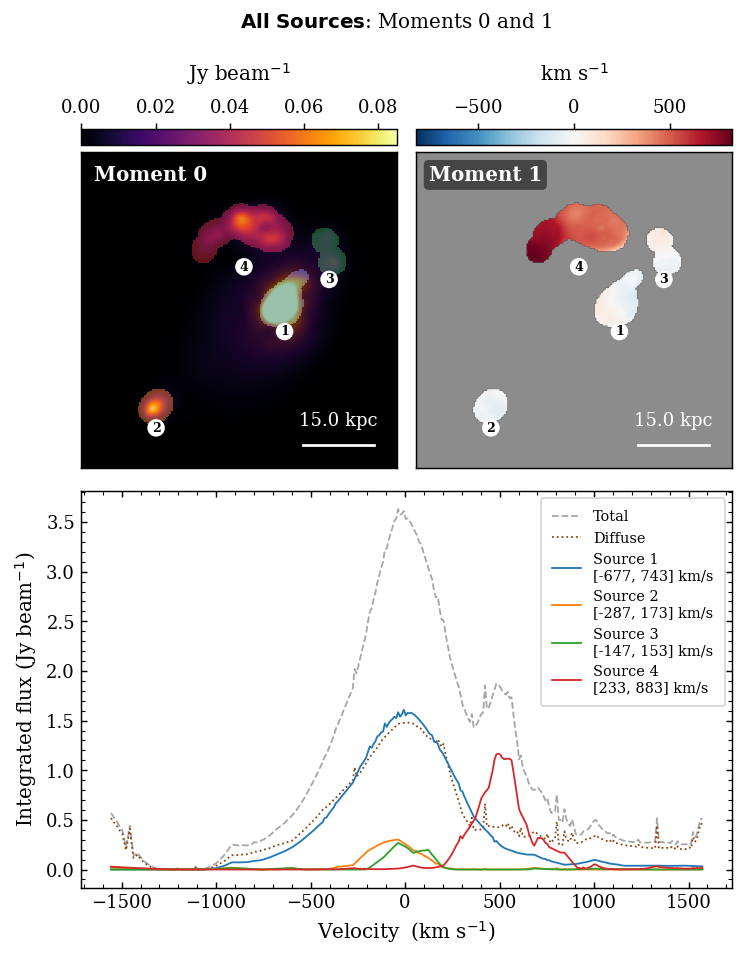

Graphical Interface
===================

NEMO ships a self-contained Tkinter GUI that lets you run the full pipeline
interactively — no Python scripting required.  Launch it with:

.. code-block:: bash

   nemo-gui          # via the installed entry-point
   python -m nemo.gui  # directly from the source tree

.. contents:: On this page
   :local:
   :depth: 2

---

Overview
--------

The GUI is a four-card workspace that mirrors the pipeline stages.
Each card becomes active only after the previous stage completes,
guiding you through the workflow in order.

   *Full-field moment maps produced by the GUI's Combined Analysis window.*

---

Card Layout
-----------

.. list-table::
   :header-rows: 1
   :widths: 15 85

   * - Card
     - Purpose
   * - **Moment 0**
     - Load a spectral cube and inspect the integrated intensity map.
       Supports FITS, HDF5, NumPy ``.npy``/``.npz``.
   * - **Wavelet Detections**
     - Configure the starlet wavelet detector, run source identification,
       and browse per-channel detection overlays.
   * - **Flow Tracking**
     - Tune TV-L1 optical flow parameters and inspect the per-channel
       flow field.
   * - **Source Grouping**
     - Browse the final source catalogue; open moment maps, spectra,
       and per-source analysis windows.

The animated GIF strip beneath each card preview is synchronised — all
four cards step through spectral channels together at 220 ms per frame.

---

Loading a Cube
--------------

1. Click **Load Cube** on the *Moment 0* card.
2. Select a file.  Supported formats:

   - ``*.fits`` / ``*.fit`` — ALMA FITS cubes; beam and WCS read automatically.
   - ``*.h5`` / ``*.hdf5`` / ``*.hdf`` — HDF5 toy-cube convention
     (dataset ``cube``, beam attrs, ``channel_velocities_km_s``).
   - ``*.npy`` / ``*.npz`` — raw NumPy arrays (no beam or WCS).

3. The moment-0 map renders immediately.  A scale bar and beam ellipse
   appear if pixscale and beam metadata are present.

**Cube scaling** (available immediately after load):

.. list-table::
   :header-rows: 1
   :widths: 20 80

   * - Mode
     - Effect
   * - ``linear``
     - No transformation; raw flux values passed to the detector.
   * - ``log``
     - ``log1p(clip(cube, 0))`` — compresses dynamic range.
   * - ``power``
     - ``clip(cube, 0) ** γ`` — adjustable gamma (default 0.5).

---

Wavelet Detection — Configure & Run
-------------------------------------

Click **Configure & Run Decomposition** on the *Wavelet Detections* card
to open the **Scale Viewer**.

Scale Viewer
~~~~~~~~~~~~

The Scale Viewer renders the per-channel starlet coefficient maps side-by-side.
Use it to choose the detail band that best isolates your sources before committing
to a full pipeline run.

.. list-table::
   :header-rows: 1
   :widths: 25 75

   * - Control
     - Description
   * - **Number of scales** radio buttons
     - Sets the total decomposition depth *J* (2 … max).
       Max is floor(log₂(min(H,W))) − 1.
   * - **Choose scale** radio buttons
     - Highlights the selected detail band (1-based).
       The chosen scale is used for component extraction.
   * - **k-sigma**
     - Detection threshold in units of per-scale noise σ.
       Lower values detect fainter sources at the cost of more false detections.
   * - **Min area (px)**
     - Discard connected components smaller than this many pixels.
   * - **Flux threshold (% of cube max)**
     - Absolute flux floor expressed as a percentage of the cube maximum.
       Leave blank to use the automatic k-sigma estimate.
   * - **Save Parameters**
     - Stores the parameters and closes the viewer.

Detection parameters
~~~~~~~~~~~~~~~~~~~~

.. list-table::
   :header-rows: 1
   :widths: 25 15 60

   * - Parameter
     - Default
     - Description
   * - ``scales``
     - 6
     - Total starlet levels (5 detail bands + 1 coarse residual).
   * - ``k_sigma``
     - 5.0
     - Detection threshold in σ units.
   * - ``use_scale``
     - 5
     - 1-based detail band used for component extraction.
   * - ``min_area``
     - 20
     - Minimum component area in pixels.
   * - ``thresh``
     - *(auto)*
     - Absolute flux floor; ``None`` uses 10 % of channel peak.
   * - ``use_mean_map_sigma``
     - ``True``
     - Anchor noise estimate to the mean-map decomposition.

Running Source Identification
~~~~~~~~~~~~~~~~~~~~~~~~~~~~~

Click **Run Source ID** to execute the full pipeline in a background thread:

1. Starlet wavelet detection (logs stream to the *Wavelet Detections* card).
2. Masked TV-L1 optical flow (logs stream to the *Flow Tracking* card).
3. Track linking + split/merge detection (logs to *Source Grouping* card).
4. Source grouping + false-detection removal.

The GIF strip updates live as each stage finishes.  You can toggle between
the preview figure and the log output using the **Show Logs / Show Figure**
button that appears in the top-right corner of each card's preview square.

---

Optical Flow Parameters
-----------------------

Open via **Optical Flow Parameters** on the *Flow Tracking* card at any
time after loading a cube.

.. list-table::
   :header-rows: 1
   :widths: 30 15 55

   * - Parameter
     - Default
     - Description
   * - ``min_match_overlap``
     - 5
     - Minimum pixel overlap between an advected mask and a detected
       component footprint to accept a track continuation.
   * - ``max_gap_channels``
     - 5
     - Maximum consecutive unmatched channels before a track is deactivated.

---

Slice Viewer
------------

Available from all four cards via **View Slice**, **View Detections**,
**View Flow per Channel**, and **View Sources per Channel**.

.. list-table::
   :header-rows: 1
   :widths: 20 80

   * - Control
     - Description
   * - **Colormap** dropdown
     - Switch between inferno, viridis, magma, plasma, and seven other colormaps.
   * - **Norm** radio buttons
     - ``linear`` · ``log`` · ``power`` — applied on-the-fly without rerunning the pipeline.
   * - **vmin / vmax sliders**
     - Fine-tune the display range; value labels update in real time.
   * - **Channel slider**
     - Step through the cube one channel at a time.
       In detection / flow / sources modes only active channels are shown.
   * - **Sources checkbox panel** *(sources mode only)*
     - Toggle per-source overlay visibility.

---

Analysis Windows
----------------

Both windows open from the *Source Grouping* card after tracking completes.

Combined Analysis
~~~~~~~~~~~~~~~~~

Opens with **Combined Analysis**.  Shows:

- **Moment 0** — integrated intensity map with per-source colour overlays.
- **Moment 1** — flux-weighted mean velocity map masked to source footprints.
- **Integrated spectra** — toggleable curves for the total flux, diffuse
  (non-source) flux, and each individual source.

Individual Source Analysis
~~~~~~~~~~~~~~~~~~~~~~~~~~

Opens with **Individual Analysis**.  Cycle through sources using the radio
buttons on the right panel.  For the selected source shows:

- **Moment 0** crop — centred on the source bounding box with a 8 px padding.
- **Moment 1** crop — flux-weighted velocity map inside the footprint.
- **Spectrum** — integrated flux per channel with a shaded span marking the
  detected channel range.

---

View All Logs
-------------

Click **View All Logs** in the banner (left sidebar) to open a scrollable
window containing the full pipeline output from all three processing stages,
separated by section headers.

---

Keyboard & Mouse
----------------

.. list-table::
   :header-rows: 1
   :widths: 30 70

   * - Action
     - Effect
   * - Channel slider drag
     - Step through cube channels in any viewer.
   * - Colormap / Norm change
     - Instant redraw — no recomputation needed.
   * - Toggle button (preview square)
     - Switch between figure preview and log output within each card.
   * - Source checkboxes (sources mode / combined analysis)
     - Hide/show individual source overlays without rerunning.

---

Banner Controls
---------------

The vertical banner on the left side of the main window contains:

.. list-table::
   :header-rows: 1
   :widths: 25 75

   * - Button
     - Effect
   * - **GitHub**
     - Opens the repository in your browser.
   * - **Docs**
     - Opens this documentation site.
   * - **View All Logs**
     - Full pipeline log across all stages in a scrollable window.
   * - **Reset**
     - Clears all pipeline results and returns every card to its initial
       state.  The loaded cube is preserved in the *Moment 0* card.
